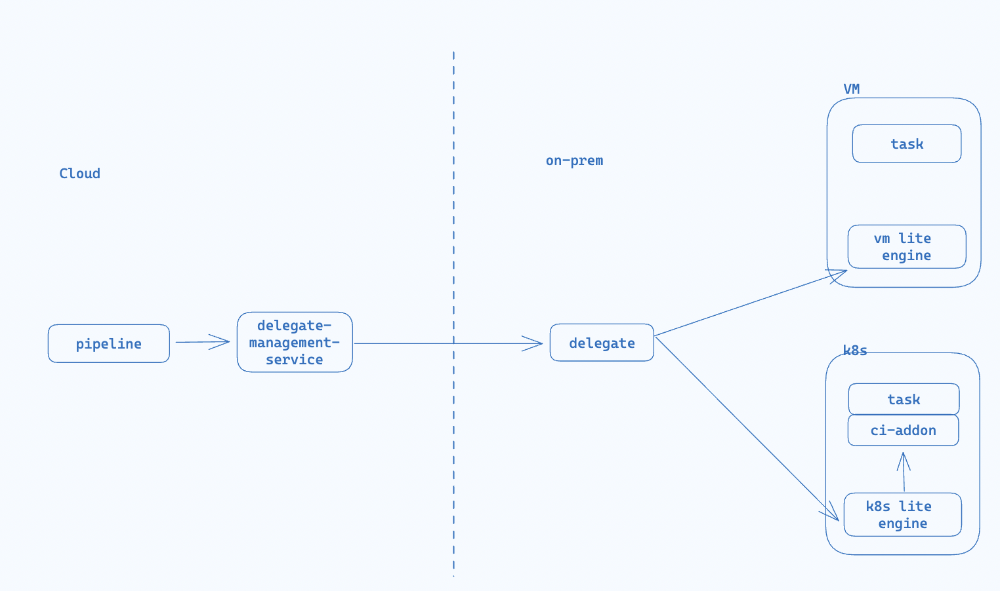
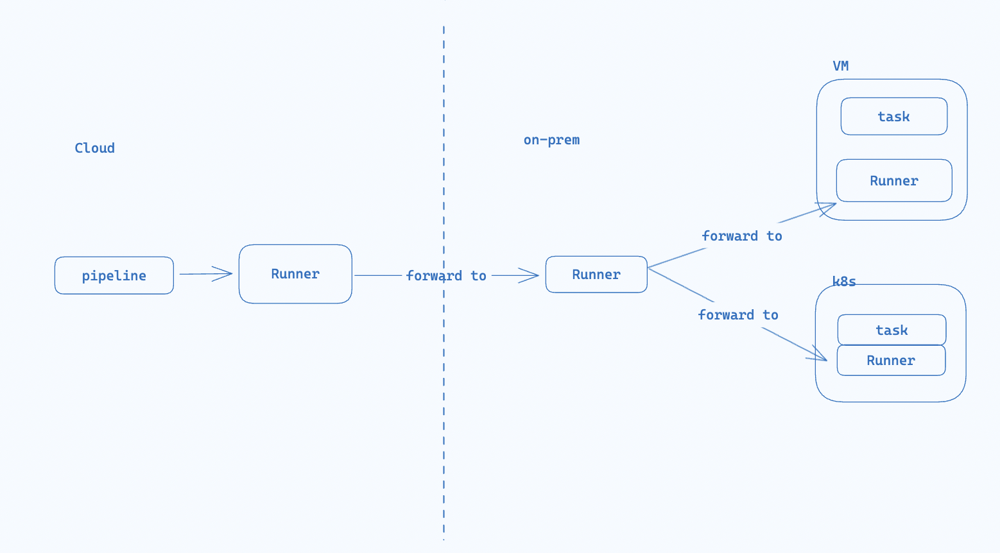
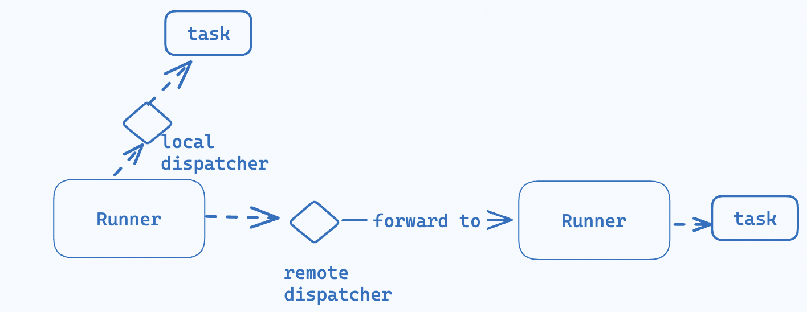

# Runner
- [Runner](#runner)
  - [About](#about)
  - [Runner Unification](#runner-unification)
    - [Dispatcher Abstraction](#dispatcher-abstraction)
  - [Primitives](#primitives)
  - [Tasks](#tasks)
      - [Schema](#schema)
      - [Outputs](#outputs)
    - [Task Types](#task-types)
    - [Task Group](#task-group)
      - [Schema](#schema-1)
      - [Task Group Result](#task-group-result)
    - [Sample](#sample)
  - [Next](#next)
## About
Runner support executing tasks in various environments, for example k8s, docker, MacOs, Linux and Windows.

## Runner Unification
Runner unification stands for a new schema of architecture design, where we define the abstraction of every component and unify those who are doing the same job. Let's look at what is today


Looking at the architecture today, we have `delegate` `delegate-management-service` `k8s lite engien` `ci-addon` `vm lite engine` all serves as the same purpose: to schedule and execute certain tasks. Therefore, the unification for `Runner` means, we design and implement one `Runner` to replace all these. 


### Dispatcher Abstraction
Runner in general has two types of execution.
1. Run the tasks locally.
2. Forward the tasks to a remote Runner to run.
We will design an abstraction called `Dispatcher`. And there are two types
1. `Local Disatcher`: It will execute a [TaskGroup](#task-group) locally
2. `Remote Dispatcher`: it will forward a a [TaskGroup](#task-group) to a remote Runner.

With the `Dispatcher` abstraction, we achieve more unification and thus extremely simplify our system. For the below use cases, we can unify into one solution
1. Some tasks run in the Harness Cloud while some to Run in customers' on-prem
2. Task executed by Runner A requires a secret. However, this secret can only be fetched from Runner B. [details](./task/forwardtasks/README.md)




## Primitives
Coming to design a `Runner`, the important thing is to think what are the primitives a Runner provides.

## Tasks
Runner is a general task engine, it executes tasks. Runner natively implements a list of task types.

#### Schema
| config | description
| ---  | ---
| name | Task name. Task name should be unique within a task group
| type | Task type
| spec | Inputs of the task
| imports | List of variables to import
| imports.[*].from | The task name where the variable is from
| imports.[*].variable | The name of the variable to import
| exports | List of output variables to export. Once exported, those variables will be visible to subsequent tasks 
| exports.[*].name | The name of the variable to export
| exports.[*].confidential | if `true`, the variable will be masked in logs
| exports.[*].scope | The scope of the exported variable. Read [output](#outputs)
| depends_on | Specifies list of tasks need to execute before this one
| forward | Specifies where to execute the task.
| forward.to | IP or Hostname of the Runner where the task will be relayed to for execution.

#### Outputs
`exports` section defines the output variables of this task. There is a scope field in every exported variable. The `scope` defines at which level the variable is accessible.

| scope | description
| --- | ---
| local | The variable will be accessible by other task in the same group
| global | The variable will have `local` accessibility. In addition, it will appear in the [Task Group Result](#task-group-result)

### Task Types
Please go to `taskimpl` folder for different implementations of tasks.


### Task Group
Runner executes a Task Group at a time.

A task group consists of multiple tasks. Tasks in the task group can have causal dependencies. For example, the input of one task may require the output variables from a previous task. The other example is, one task requires the downloaded artifact from a previous task.

To support variable passing, we provide `export` and `import` declarative. See [example](#sample).

To support artifact sharing, we provide `depends_on` declarative. This will make sure the dependent tasks will be executed beforehand. See [example](#sample).

#### Schema
| config | description
| --- | ---
| taskGroup | A list of tasks to execute
| forward | Specifies where to execute the task.
| forward.to | IP or Hostname of the Runner where the task will be relayed to for execution.

#### Task Group Result
Task Group Result is the execution result of the task group.

| fields | description
| --- | ---
| id | id of the task group
| results[task_name].status | The status of the execution. eg. `failed` `success` `skipped`
| results[task_name].name | Task name
| results[task_name].id | Task id
| results[task_name].outputs | Map of output variable name and value

### Sample 
```
taskGroup: 
- name: foo,
  type: os_exec,
  spec:
    command: |
      secret=curl https://vault...;
      echo "password=${secret}" > ${OUTPUT_FILE}_foo;
  exports:
  - name: password
    confidential: true
    scope: local
- name: bar,
  type: os_exec,
  spec:
    command: ["/bin/bash" "-c", "echo '{{ .foo.password )}'"],
    envs:
    - key: value
  depends_on: foo,
  imports:
  - from: foo,
    variable: password
```

## Next
1. How to do expression evaluation for some use cases [expression evaluation task](./taskimpl/expreval/README.md)
2. How to fetch secret and how to make secret fetch a swappable "plugin" [Hashicorp Vault Task](./taskimpl/secretfetch/vault/README.md)
3. How to do secret fetch behind customers' firewall  [task relay](./task/forwardtasks/README.md)
4. How to run Github actions natively [Github action task](./taskimpl/github_action/README.md)
5. How to implement your own driver that support customized task types. [drivers](./drivers/README.md)
6. Task execution results can be cached. Please read [cache](./cache/README.md#cache)