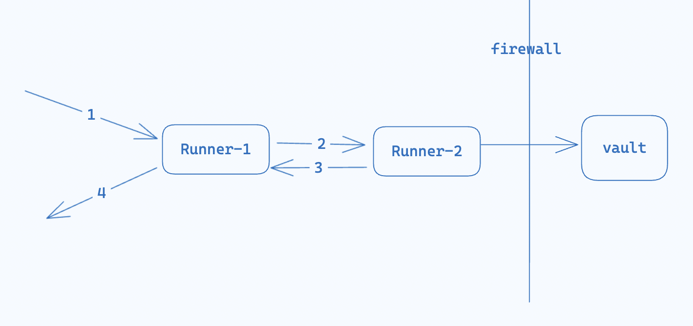

# Task Forwarding
There is a common use case learnt from customers. To executing a task, it requires a secret as a input. However, the secret is stored in a secret manager that is not accessible by the Runner who executes the task.

## Challenge
While an obvious solution is to fetch the secret and send it back to the orchestration server (on the cloud), so that the orchestration server will provide it as input to that task. This solution poses a significant security risk, as customers' secrets will be exposed to Harness server.

## Solution
Therefore, Runner will provide a task forwarding capability. The Runner who executes the task, will forward the secret fetching work to another Runner who can fetch it. The secret will be sent back to the Runner who executes the task.


## Sample
```
taskGroup:
- name: fetch-secret
  type: vault
  spec:
    secret_name: password
    path: ...
    role: ...
    url: ...
  forward:
    to: 10.0.0.5:8888
  exports:
    - name: password
      scope: local
      confidential: true  // it will be masked in logs
- name: curl_with_password,
  type: os_exec,
  spec:
    command: ["/bin/bash" "-c", "echo '{{ .fetch-secret.password )}'"],
    envs:
    - key: value
  imports:
  - from: foo,
    variable: password
```